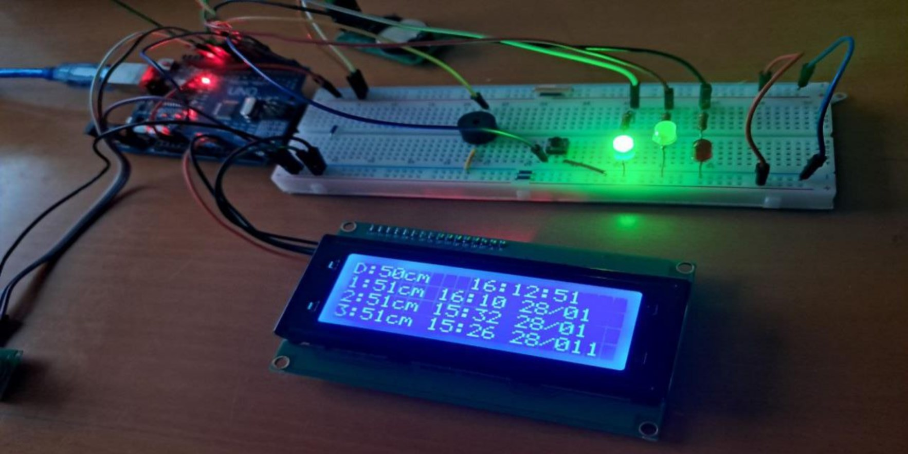

# Багатофункціональний ультразвуковий далекомір (Arduino Uno)

Багатофункціональний ультразвуковий далекомір на базі Arduino Uno з фіксацією часу вимірювань у реальному часі, збереженням історії вимірювань в енергонезалежній пам'яті та триступеневою системою світлової й звукової сигналізації.

Розроблено як мультидисциплінарний курсовий проєкт (напрям комп'ютерної інженерії, вбудовані системи), що охоплює повний інженерний цикл: аналіз вимог → розробка схем → написання прошивки → моделювання → фізичне прототипування → експериментальна перевірка.

## Функціональні можливості

- Безконтактне вимірювання відстані (діапазон: 2–400 см, точність: ±1–3 см) за допомогою ультразвукового сенсора HC-SR04
- Фіксація часу кожного вимірювання за допомогою модуля реального часу DS1307
- Збереження трьох останніх вимірювань в енергонезалежній пам'яті EEPROM з автоматичним відновленням після втрати живлення/перезавантаження
- Одночасне відображення поточного вимірювання, поточного часу та історії попередніх вимірів на LCD-дисплеї 20x4 з I2C
- Триступенева система світлової та звукової сигналізації:
  - Зелений світлодіод — відстань ≥ 50 см
  - Жовтий світлодіод — відстань 20–49 см
  - Червоний світлодіод + п'єзо-зумер — відстань < 20 см
- Керування однією кнопкою (коротке натискання: перемикання режиму вимірювання / довге натискання: збереження поточного вимірювання)

## Апаратна частина

| Компонент | Призначення |
|---|---|
| Arduino Uno (ATmega328P) | Основний контролер |
| HC-SR04 | Ультразвуковий датчик відстані |
| DS1307 | Модуль реального часу |
| LCD 2004 + I2C-адаптер | Дисплей |
| 3× світлодіод (зелений/жовтий/червоний) | Світлова сигналізація |
| П'єзо-зумер | Звукова сигналізація |
| Кнопка | Введення команд користувача |

Повне обґрунтування вибору елементної бази, схеми та розподіл пінів наведені в супровідній пояснювальній записці проєкту (див. `/docs`).

## Процес розробки та верифікації

1. **Проєктування** — структурна та функціональна схеми розроблені на основі технічного завдання.
2. **Моделювання** — повна схема та прошивка перевірені в середовищі Proteus 8 Professional до фізичного монтажу, що дозволило виявити логічні помилки на ранньому етапі.
3. **Фізичне прототипування** — зібрано на макетній платі, живлення через USB (перевірено мультиметром — 4.98 В).
4. **Тестування** — точність вимірювань, пороги сигналізації та збереження даних в EEPROM перевірені через Serial Monitor і фізичні випробування; результати збіглися з результатами моделі в межах очікуваної похибки датчика.

## Демонстрація

*Повністю зібраний прототип на макетній платі*

*Відстань ≥ 50 см — активний зелений світлодіод*

*Відстань < 20 см — активні червоний світлодіод та зумер*

## Прошивка

Основний файл: [`distance_meter.ino`](distance_meter.ino)

Написано мовою C++ у середовищі Arduino IDE. Використані бібліотеки: `Wire.h`, `LiquidCrystal_I2C.h`, `RTClib.h`, `EEPROM.h`.

## Автор

Владислав Дем'янюк — випускник Вінницького технічного фахового коледжу за спеціальністю "Комп'ютерна Інженерія".
